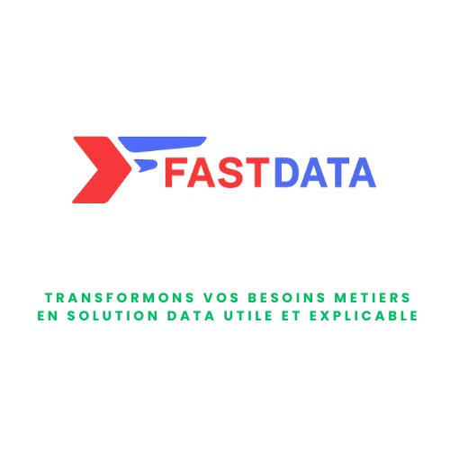

# Fastdata - Services Data Engineering & BI

Portfolio statique de services freelance data : stabilisation de pipelines, automatisation de scripts, qualité de données, Power BI, structuration.

## 🚀 Services data 

| **Service** | **Votre difficulté** | **Pourquoi ça arrive** | **Résultat** |
|-------------|-------------------------|-----------------------|--------------|
| **1. Pipelines robustes** | Pipelines qui cassent, ralentissent, impossibles à maintenir | Dette technique, orchestration fragile, manque de logs/monitoring | Flux stables, monitorés, prêts prod (Airflow, Prefect, Docker, Data Lake) |
| **2. Automatisation scripts** | Scripts Python/API/Excel cassent souvent | Manque de temps, structure, logique d'automatisation | Automatisations fiables, simples à maintenir (Python + cron, petits ETL) |
| **3. Données propres** | Données sales, incohérentes, dispersées Excel/CSV | Absence de règles nettoyage/normalisation | Données prêtes usage : SQL/data lake minimal |
| **4. Power BI fiable** | Rapports lents, KPI incohérents, difficiles à maintenir | Modèle mal structuré, DAX ambigu, transformations éparpillées | Rapports rapides, KPI alignés (Power BI, DAX, Power Query) |
| **5. Structuration données** | Données dispersées, mal nommées, non documentées | Absence de référentiels/schémas clairs | Base solide BI/pipelines : schémas SQL, documentation utile |

## 📞 Contact

**Talardia Gbangou**  
*Data Engineer & BI freelance*  
📍 Amiens, Hauts-de-France  

  
    

| 📧 Email | 💼 LinkedIn | 🌐 Portfolio | 📱 Téléphone |
|----------|-------------|--------------|--------------|
| [talardia.gbangou@gmail.com](mailto:talardia.gbangou@gmail.com) | [linkedin.com/in/talardiagbangou](https://linkedin.com/in/talardiagbangou) | [fastdata.vercel.app](https://test-portfolio1-kappa.vercel.app/) | +33 7 82 91 01 22 |

